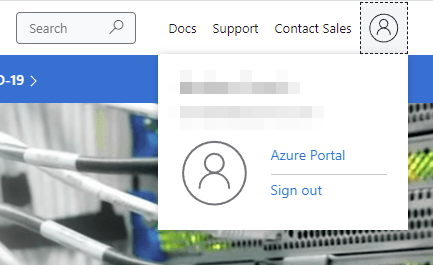
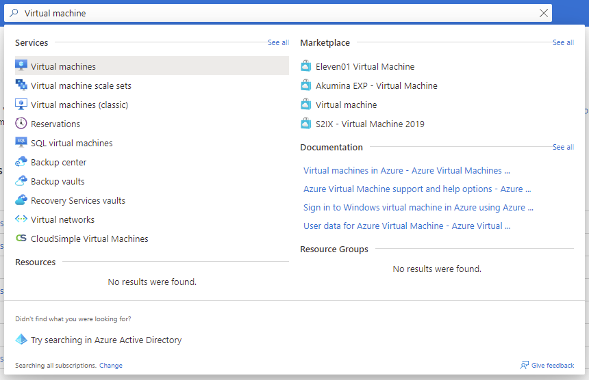
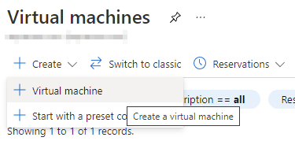
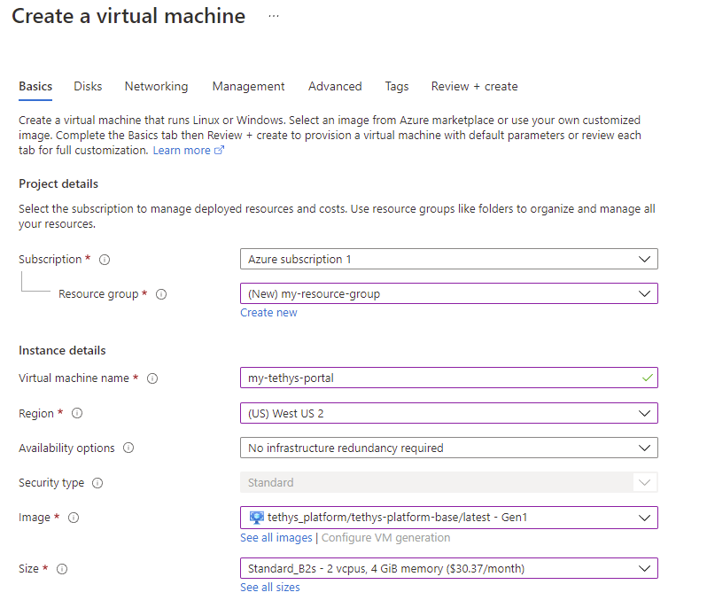
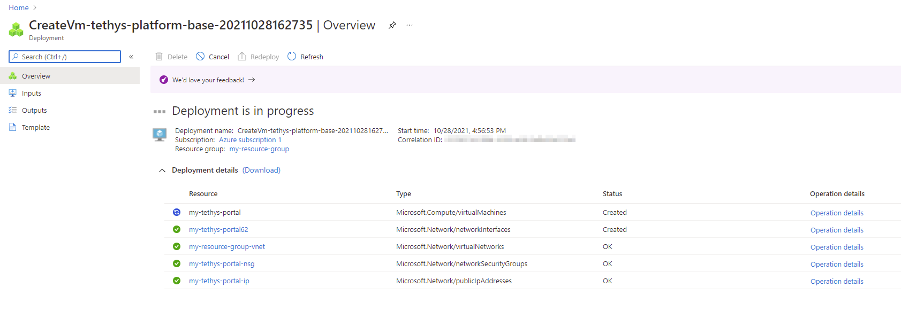
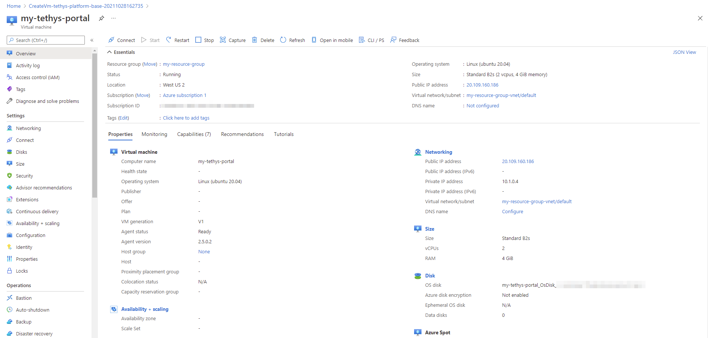
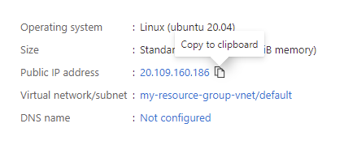
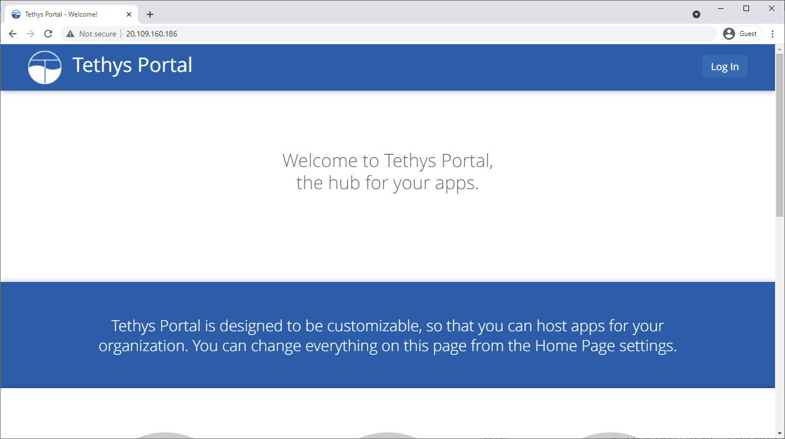

# Create Virtual Machine

## 1. Login to Azure Portal

Navigate to https://azure.microsoft.com/ and Sign In using the ***Sign in*** link. Open the user dropdown menu and click on the ***Azure Portal*** link.

**Azure Portal link in the user menu.**

## 2. Navigate to Virtual machines management page

Use the search bar to search for "Virtual machine" and select the ***Virtual machines*** link.

**Search for "Virtual machine".**

## 3. Create virtual machine

Click on the ***Create*** button to open the drop-down menu and select ***Virtual machine***.

**Create a new virtual machine.**

## 4. Configure virtual machine

Fill in the "Create a virtual machine" form as follows:

### Project Details

* **Subscription**: Select the desired subscription that will be used for billing the virtual machine usage.
* **Resource group**: Select a resource group or create a new one using the ***Create new*** link.

### Instance Details

These are technical details about the virtual machine that will be created.

* **Virtual machine name**: Give the virtual machine a name.
* **Region**: Select an appropriate region, this is the approximate location of the data center where the virtual machine will be created.
* **Image**: Search for "tethys-platform" and select the "tethys_platform/tethys-platform-base/latest" image.
* **Size**: Choose the size of hardware for your virtual machine. We recommend a machine with at least 2 cpus (vcpus) and 4 GiB of memory (e.g. Standard_B2s). Click on the ***See all sizes*** link to see a list of all the sizes to compare costs.

### Administrator account

Specify the credentials for the administrator account as well. This account will be used to log in to the virtual machine:

* **Authentication type**: We recommend using SSH public keys, but you can use a password if you are not sure what an SSH key is.
* **Username**: Create a unique username (don't use something generic like "admin").
* **SSH public key source** and **Key pair name**: if using SSH keys, you can choose to create a new key pair or use an existing key pair if you have one already.

### Inbound port rules

* **Public inbound ports**: Select ***Allow selected ports***.
* **Select inbound ports**: Select ***SSH (22)*** and either of ***HTTP (80)*** or ***HTTPS (443)***.

### Licensing

* **License type**: Select ***Other***.

**Example of the "Create a virtual machine" form.**

## 5. Create disks

Press the ***Next: Disks >*** button to proceed to the **Disks** tab. You will create the hard drive for the virtual machine to use on this page.

### Disk Options

* **OS disk type**: Select the type of disk you'd like the VM to have. We'd recommend one of the SSD options. Standard SSD should work for a lot of deployments, but if you plan to use GeoServer, you may want to consider Premium SSD for better performance.
* **Encryption type**: adjust to taste.

### Data disks (optional)

Use this section to attach additional disks to the VM if you'd like.

## 6. Review other tabs

The default options in the other tabs should be ok, but take a few minutes to click through the tabs and review the options.

When you are done, click on the ***Review + create*** button.

## 7. Review and create

Review the options and make any changes if needed. Then press the ***Create*** button.

!!! attention
    If you chose to generate a new key pair, don't forget to download the private key. Keep this file in a safe place and don't lose it.

## 8. Twiddle thumbs

It will take a few minutes for the virtual machine and side-car resources to be created. You should be taken to a progress page like the one below that will keep you apprised of the deployment status.

**Deployment progress page.**

## 9. Review resource page

When finished, the progress page will report something like "Your deployment is complete". At this point, press the ***Go to resource*** button. 

This will bring you to the Overview page of the Virtual Machine. This view provides a sort of dashboard for the virtual machine and provides controls for starting, stopping, and connecting to the virtual machine. 

Take a few minutes to familiarize yourself with the Overview page. If you are feeling brave you may also want to click through the other links in the navigation on the left to familiarize you with their content.

**Virtual machine resource overview page.**

## 10. View the Tethys Portal

A few minutes after the Virtual Machine starts, Tethys Portal should be viewable. Locate the **Public IP address** field in the **Essentials** section (top-right). This is the IP address the virtual machine and where you can access it for now.

a. Press the ***Copy to clipboard*** button next to the IP address.

**Copy the public IP address.**

b. Paste the IP address in the address bar of a new tab in your web browser. A default version of Tethys Portal should be displayed.

**Tethys Portal running on Azure VM.**

!!! note
    It can take Tethys Platform a few minutes to start up after the VM starts. If you receive a 502 Gateway error, wait a few minutes and try again.

## Additional Resources

Use the following resources to learn more about creating Virtual Machines on Microsoft Azure:

* [Virtual machines in Azure](https://docs.microsoft.com/en-us/azure/virtual-machines/)
* [Quickstart: Create a Linux virtual machine in Azure portal](https://docs.microsoft.com/en-us/azure/virtual-machines/linux/quick-create-portal)
* [Create a Linux virtual machine in Azure](https://docs.microsoft.com/en-us/learn/modules/create-linux-virtual-machine-in-azure/)
* [VM deployment issues](https://docs.microsoft.com/en-us/troubleshoot/azure/virtual-machines/welcome-deployment-troubleshooting)

## What's Next?

Congratulations! You have a Tethys Portal running in Azure. In the next tutorial you will learn how connect to the VM and configure and customize the Tethys Portal.